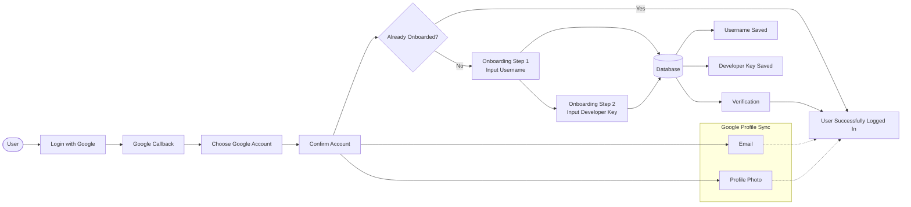

# Google OAuth Login Workflow

## Mermaid Flowchart

## Workflow

1. User menekan **Login with Google**.
2. Aplikasi mengirim user ke OAuth Google.
3. Google mengembalikan callback ke aplikasi.
4. User memilih dan mengonfirmasi akun Google.
5. Sistem mengecek apakah onboarding sudah pernah diselesaikan.
6. Jika belum:
   - **Step 1:** Input Username.
   - Username disimpan ke database.
   - **Step 2:** Input Developer Key.
   - Developer Key disimpan ke database.
7. Sistem melakukan verifikasi.
8. User berhasil login.

## Data yang Disimpan

| Field         | Keterangan                          |
| ------------- | ----------------------------------- |
| Google ID     | ID unik Google                      |
| Email         | Sinkron otomatis dari Google        |
| Profile Photo | Sinkron otomatis dari Google        |
| Username      | Input onboarding                    |
| Developer Key | Password pribadi untuk login manual |

## Perbedaan Login

| Google Login                  | Manual Login                              |
| ----------------------------- | ----------------------------------------- |
| Email tersedia                | Tidak                                     |
| Foto profil tersedia          | Tidak                                     |
| Sinkron dengan Google         | Tidak                                     |
| Username tetap digunakan      | Username digunakan                        |
| Developer Key tetap tersimpan | Developer Key digunakan untuk autentikasi |
